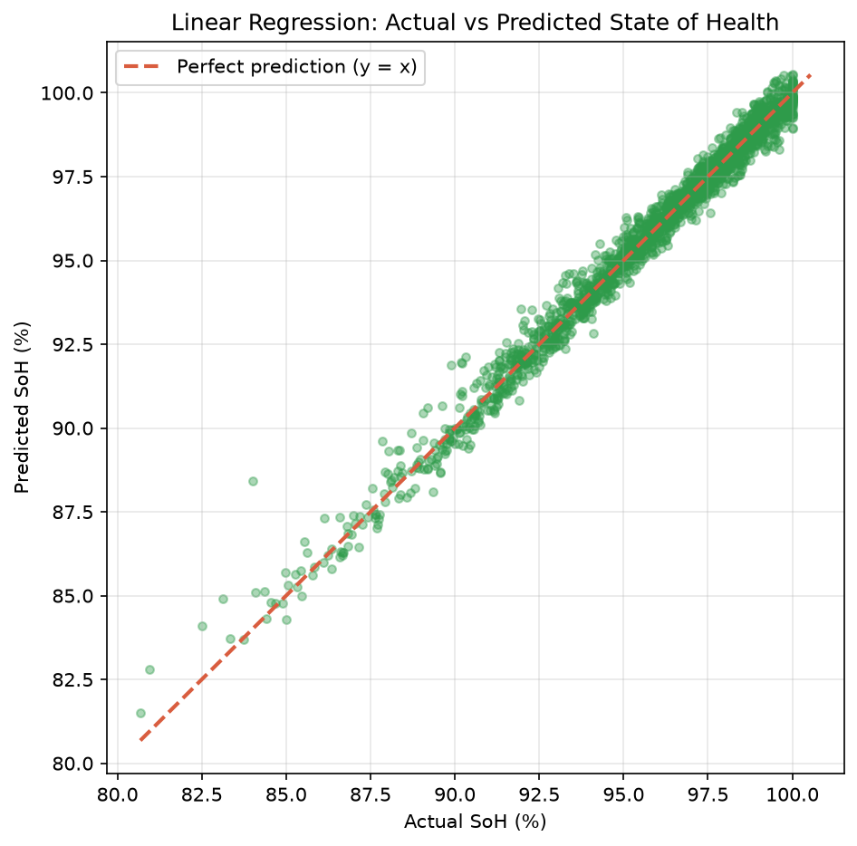

<div align="center">

# EV Battery Health Prediction — State of Health with Linear Regression

**Predict how much life an EV battery has left — from charging and usage data — with a Linear Regression model.**

This repository contains a complete, submission-ready machine learning project: the full notebook pipeline (`analysis.ipynb`), real results (R² = 0.984), and — as a bonus — a live interactive demo of the model running in the browser.

[](https://www.kaggle.com/datasets/bertnardomariouskono/electric-vehicle-ev-battery-degradation-and-charge)
[](analysis.ipynb)
[](analysis.ipynb)
[](https://www.kaggle.com/datasets/bertnardomariouskono/electric-vehicle-ev-battery-degradation-and-charge)

[](https://scikit-learn.org/)
[](analysis.ipynb)
[](https://abhiramgangadharan07-crypto.github.io/ev-battery-health-site/)
[](LICENSE)

</div>

---

## Table of contents

- [1. Research problem](#1-research-problem)
- [2. Dataset](#2-dataset)
- [3. Methodology](#3-methodology)
- [4. Results](#4-results)
- [5. The notebook, cell by cell](#5-the-notebook-cell-by-cell)
- [6. How to run](#6-how-to-run)
- [7. Repository structure](#7-repository-structure)
- [8. Interactive demo (website)](#8-interactive-demo-website)
- [9. Troubleshooting](#9-troubleshooting)
- [Author](#author)
- [License](#license)
- [Credits](#credits)

---

## 1. Research problem

An EV battery degrades every time it is charged, discharged, and thermally stressed. The **State of Health (SoH)** measures how much of its original capacity a battery still has:

```
SoH (%) = (current maximum capacity / nominal capacity when new) × 100
```

A battery starts at ~100% and is typically considered **"end of life" around 80%**. Estimating SoH from everyday data (charge cycles, temperature, age, chemistry) matters for three practical reasons:

1. **Safety** — a degraded battery is more likely to overheat, swell, or fail unpredictably. Monitoring SoH helps detect dangerous cells early.
2. **Resale value** — the biggest single factor deciding a used EV's price is the remaining health of its battery. Buyers and sellers need an honest estimate.
3. **Maintenance planning** — knowing how fast a pack is losing capacity lets owners and fleet operators schedule replacements or warranty claims before the battery leaves the vehicle.

SoH estimation is a textbook **regression** problem: the target is a continuous number, and we predict it from measurable features.

## 2. Dataset

- **Name:** Electric Vehicle (EV) Battery Degradation & Charge
- **Owner / link:** [Kaggle — bertnardomariouskono](https://www.kaggle.com/datasets/bertnardomariouskono/electric-vehicle-ev-battery-degradation-and-charge)
- **Size:** 10,000 battery samples × 13 columns, no missing values
- **Chemistry:** NMC (nickel–manganese–cobalt) and LFP (lithium-iron-phosphate) — encoded via the `Battery_Type` column
- **Features:** battery capacity (kWh), vehicle age (months), total charging cycles, average temperature (°C), fast-charge ratio, discharge rate (C), internal resistance (Ω), driving style, car model, battery status
- **Target:** `SoH_Percent` (State of Health, %) — continuous, used as-is for regression; the notebook also detects any column named *soh* automatically

The CSV is downloaded from Kaggle (account required) and placed in `data/` — the notebook finds it automatically, whatever its name.

## 3. Methodology

The pipeline in `analysis.ipynb` follows these steps:

| Step | What we do | Why |
| ---- | ---------- | --- |
| **Load** | `pd.read_csv()` + `df.head()` | Verify the data was read correctly |
| **Inspect** | print `df.shape`, `df.dtypes`, missing values, `df.describe()` | Check data before modelling |
| **Clean** | select the `SoH_Percent` target, drop the `Vehicle_ID` ID column, drop rows with missing values | IDs carry no information; models cannot learn from empty cells |
| **Encode** | one-hot encode the text columns — `Battery_Type` (NMC/LFP), `Car_Model`, `Driving_Style`, `Battery_Status` — with `pd.get_dummies(..., drop_first=True)` | sklearn only accepts numbers; each category becomes its own 0/1 column |
| **Split** | `train_test_split(X, y, test_size=0.2, random_state=42)` | Train on 80%, test on the 20% the model never saw |
| **Train** | `LinearRegression().fit(X_train, y_train)` | Find the coefficients that best explain SoH |
| **Evaluate** | `r2_score` and RMSE on the test set | Measure how well the model generalises |
| **Visualise** | scatter plot actual vs predicted SoH + perfect-prediction diagonal, saved to `images/result_plot.png` | Sanity-check the model visually |

### Why Linear Regression fits this problem

- Battery capacity fades **roughly linearly** with usage (cycles, age): over the observed range the relationship is near-linear, so a linear model is a theoretically sound baseline.
- It is **interpretable**: each fitted coefficient tells us the direction and size of a factor's effect (e.g. how many percentage points one more charging cycle costs).
- It is fast, has no hyper-parameters, and is the standard benchmark every more complex model is compared against.

## 4. Results

The model was trained on **8,000** of the 10,000 samples and evaluated on the **2,000** unseen ones (`random_state=42`). The values below are the *actual outputs* of the notebook:

| Metric | Value | What it means |
| ------ | ----- | ------------- |
| **R² (R-squared)** | **0.984** | The model explains 98.4% of the variation in battery health in the test set — an excellent fit. |
| **RMSE** | **0.413 pp** | The average prediction error is about **±0.41 percentage points** of SoH. |

**In plain language:** given a battery's charging/usage readings and its chemistry, the model can estimate its State of Health to within about half a percentage point — good enough to flag end-of-life batteries reliably (`SoH < 80%`).

### Evaluation plot



The red dashed diagonal is the **perfect prediction** line (`y = x`). Each dot is one test battery. The closer the dots hug the diagonal, the more accurate the model — and here the band is remarkably tight.

## 5. The notebook, cell by cell

For students, `analysis.ipynb` is written to be read and explained:

| Cells | Content |
| ----- | ------- |
| 1 | Import the libraries: pandas, numpy, matplotlib, sklearn |
| 2–3 | Load the CSV (auto-detected in `data/`) and look at `df.head()` |
| 4 | Inspect: shape, dtypes, missing values, `describe()` |
| 5 | Clean & encode: pick the concentration target, drop IDs, one-hot the categoricals |
| 6 | Train/test split: 80/20, `random_state=42` |
| 7 | Train: `LinearRegression().fit(X_train, y_train)` |
| 8 | Evaluate: prints R² and RMSE with a plain-language summary |
| 9–10 | Plot actual vs predicted with the diagonal, save to `images/result_plot.png` |

Every cell has a short comment above it explaining what it does and why.

## 6. How to run

**Requirements:** Python 3.9+, Jupyter, and the libraries in `requirements.txt`.

```bash
# 1. Clone the repository
git clone https://github.com/abhiramgangadharan07-crypto/ev-battery-health-site.git
cd ev-battery-health-site

# 2. Install dependencies
pip install -r requirements.txt

# 3. Download the dataset from Kaggle (link in section 2)
#    and place the CSV inside the data/ folder

# 4a. Interactive: open the notebook
jupyter notebook
#     -> open analysis.ipynb, select Cell > Run All

# 4b. Or headless (re-runs and saves outputs):
jupyter nbconvert --to notebook --execute --inplace analysis.ipynb
```

The narrative plot is regenerated automatically at `images/result_plot.png`.

> Optional: the same repo also contains the interactive website. You can serve it with `python -m http.server 8000` and open `http://127.0.0.1:8000` (see section 8) — or just open the live demo.

## 7. Repository structure

```
ev-battery-health-site/
├── analysis.ipynb          # THE ML ASSIGNMENT — full pipeline, commented cell by cell
├── README.md               # this file
├── requirements.txt        # Python dependencies for the notebook
├── LICENSE                 # MIT
├── .gitignore              # keeps the data/ CSV out of Git
├── data/                   # (your download) ev_battery_degradation_v1.csv goes here — not committed
├── images/
│   └── result_plot.png     # generated by the notebook, embedded above
│
├── index.html              # interactive demo website (optional bonus)
├── css/style.css           # demo theme (paper & forest green)
├── js/
│   ├── app.js              # demo prediction math, sliders, verdicts
│   └── scene.js            # demo 3D scenes (car, battery fill, point cloud)
├── assets/
│   ├── model.json          # a fitted demo model (exported from the same pipeline idea)
│   ├── points.json         # 2,000 samples for the demo 3D cloud
│   ├── ferrari.glb         # 3D car model (three.js examples, MIT)
│   ├── vendor/draco/       # Draco decoder for the GLB (local, no CDN)
│   ├── result_plot.png     # demo evaluation plot
│   └── screenshot.png      # full-page preview of the demo
├── export_model.py         # (demo) re-exports model.json from a dataset
└── crosscheck.py           # (demo) proves the browser formula matches the fit
```

## 8. Interactive demo (website)

As a bonus, the same repository ships a fully static website — **EV Battery Lab** — that lets anyone run a SoH diagnosis in their browser with a drag-spin 3D car, a live battery-fill visualisation and all samples as a rotatable point cloud.

Since a linear model is just one weighted sum, the fitted model ships as `assets/model.json` and the prediction runs **client-side** — no server, no uploads.

**Live demo:** https://abhiramgangadharan07-crypto.github.io/ev-battery-health-site/

**Run it locally:** `python -m http.server 8000` and open `http://127.0.0.1:8000` (a plain `file://` double-click won't work — browsers block `fetch` on local files).

> **Note on the demo model:** `assets/model.json` was exported from an earlier run of the same pipeline (10 features, 2,000-sample session). The **authoritative** model for this assignment is the one the notebook in section 3–5 produces on the 10,000-sample dataset.

## 9. Troubleshooting

| Symptom | Cause & fix |
| ------- | ----------- |
| `AssertionError: No CSV file found` | The dataset is not inside `data/`. Download from Kaggle (link in section 2) and put the CSV there. |
| `ModuleNotFoundError: sklearn` | `pip install -r requirements.txt` was not run, or a different Python environment is active. |
| Notebook runs but the plot is missing | The notebook saves to `images/result_plot.png` from its own folder. Run it from the repo root. |
| 3D car shows "could not load" on the demo site | WebGL disabled in the browser, or stale cache — enable hardware acceleration or hard-refresh (Ctrl+F5 / Cmd+Shift+R). |

## Author

<div align="center">

**Abhiram Gangadharan** — B.Tech Electronics & Communication Engineering, Sree Buddha College of Engineering

[](https://github.com/abhiramgangadharan07-crypto)
[](https://www.linkedin.com/in/abhiram-gangadharan-a6282a379)
[](https://www.kaggle.com/abhiramgangadharan07)
[](mailto:abhiramgangadharan07@gmail.com)

</div>

## License

Distributed under the **MIT License**. See [LICENSE](LICENSE).

## Credits

- **Dataset:** Electric Vehicle (EV) Battery Degradation & Charge — Kaggle ([bertnardomariouskono](https://www.kaggle.com/datasets/bertnardomariouskono/electric-vehicle-ev-battery-degradation-and-charge))
- **Model:** scikit-learn `LinearRegression`
- **Demo 3D:** Three.js (MIT); `ferrari.glb` from the three.js examples (MIT)
- **Demo fonts:** Fraunces, Space Mono, Hanken Grotesk (Google Fonts, OFL)