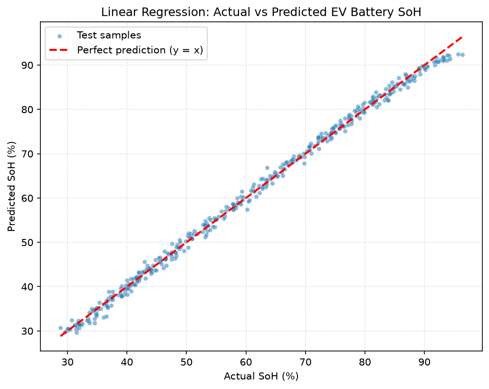

# EV Battery Lab — State of Health Predictor

An interactive website for the **EV Battery Health Prediction** machine-learning project. It showcases the model and lets anyone run a live State of Health (SoH) diagnosis in the browser.

**Live site:** hosted on GitHub Pages — see your repo's Settings → Pages, or the URL printed after first deploy.



## What it does

- **360° 3D EV showcase** — drag to spin the car in the hero (Three.js + `ferrari.glb`, auto-rotates when idle)
- **Live SoH diagnosis** — 10 sensor sliders (ranged from the real dataset) → the prediction runs **in your browser** as `SoH = intercept + Σ coefᵢ·xᵢ`; a 3D battery fills/drains to the result and shifts green → amber → terracotta
- **3D data landscape** — all 2,000 training samples rendered as a rotatable point cloud (Cycle × Temperature × SoH)
- **Methodology, results and coefficients** — the whole regression story, in plain language

## Why no backend?

Linear regression prediction is a single weighted sum, so the entire model ships as `assets/model.json` (intercept + coefficients + feature ranges). The site is 100% static — no server, no API keys, free hosting, nothing uploaded.

## Project structure

```
ev-battery-health-site/
├── index.html            # the site
├── css/style.css         # paper & forest-green editorial theme
├── js/app.js             # prediction math, sliders, health verdict, reveals
├── js/scene.js           # 3D scenes: car, battery fill, point cloud
├── assets/
│   ├── model.json        # trained model, exported full precision
│   ├── points.json       # the 2,000 samples, for the 3D cloud
│   ├── ferrari.glb       # 3D car model (three.js examples, MIT)
│   └── result_plot.png   # evaluation plot from the notebook
├── export_model.py       # re-exports model.json from the dataset
└── crosscheck.py         # proves the JS formula == sklearn (diff ~1e-14)
```

## Run locally

```bash
python -m http.server 8000
# open http://127.0.0.1:8000
```

(A plain `file://` double-click won't work — the browser blocks `fetch` on local files.)

## Regenerate the model data

`model.json` and `points.json` come from the companion project
`../ev-battery-health-prediction` (same pipeline, same `random_state=42`):

```bash
python export_model.py
python crosscheck.py   # should print MAX DIFFERENCE < 1e-9
```

## Deploy to GitHub Pages

```bash
git init
git add .
git commit -m "EV Battery Lab — SoH predictor site"
gh repo create ev-battery-health-site --public --source=. --push
gh api repos/USERNAME/ev-battery-health-site/pages -X POST \
  -f "source[branch]=main" -f "source[path]=/"
```

Then your site is live at `https://USERNAME.github.io/ev-battery-health-site/`.

## Credits

- Model & methodology: EV Battery Health Prediction project (Linear Regression, R² 0.9967 / RMSE 1.08) — dataset: *Battery State of Health Dataset*, Kaggle ([freshersstaff](https://www.kaggle.com/datasets/freshersstaff/battery-state-of-health-dataset))
- 3D: Three.js (MIT); car model `ferrari.glb` from the [three.js examples](https://github.com/mrdoob/three.js/tree/dev/examples/models/gltf)
- Fonts: Fraunces, Space Mono, Hanken Grotesk (Google Fonts, OFL)
