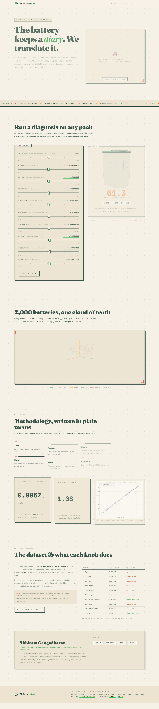

<div align="center">

# EV Battery Lab — State of Health Predictor

**A live, in-browser State of Health (SoH) diagnosis for EV batteries**

Predict how much life a battery pack has left — from ten everyday sensor readings — using a linear regression model trained on 2,000 real samples. No server. No upload. The whole model runs in your browser.

[](https://abhiramgangadharan07-crypto.github.io/ev-battery-health-site/)
[](https://abhiramgangadharan07-crypto.github.io/ev-battery-health-site/)
[](https://abhiramgangadharan07-crypto.github.io/ev-battery-health-site/)
[](https://abhiramgangadharan07-crypto.github.io/ev-battery-health-site/)


</div>

---

## Screenshot



---

## What it does

- **360° 3D EV showcase** — drag to spin a car in the hero (Three.js + `ferrari.glb`); it auto-rotates when idle
- **Live SoH diagnosis** — ten sensor sliders (ranged from the real dataset) → the prediction runs **in your browser** as `SoH = intercept + Σ coefᵢ·xᵢ`; a 3D battery fills/drains to the result and shifts green → amber → terracotta
- **3D data landscape** — all 2,000 training samples rendered as a rotatable point cloud (Cycle × Temperature × SoH)
- **Methodology, results and coefficients** — the whole regression story, in plain language, with the full-precision coefficient table

## Why no backend?

Linear regression prediction is a single weighted sum, so the entire model ships as `assets/model.json` (intercept + coefficients + feature ranges). The site is **100% static** — no server, no API keys, free hosting, nothing uploaded.

## The model behind it

| Metric | Value | Meaning |
| ------ | ----- | ------- |
| **R²** | 0.9967 | Explains 99.67% of the variation in battery health |
| **RMSE** | 1.08 pp | Typical predictions land within ±1 percentage point of true SoH |
| **Training set** | 1,600 samples | 80% of the dataset |
| **Test set** | 400 samples | 20% held out, never seen during training |

Trained with `scikit-learn`'s `LinearRegression` (random_state=42) — the companion repository is [`ev-battery-health-prediction`](https://github.com/abhiramgangadharan07-crypto/ev-battery-health-prediction) with the full notebook.

## Tech stack

| Layer | Technology |
| ----- | ---------- |
| Markup & style | Semantic HTML5, hand-written CSS (paper & forest-green editorial theme) |
| 3D rendering | Three.js r128 (car, battery fill, point cloud) |
| Prediction | Vanilla JS — a single weighted sum over the exported coefficients |
| Model | Python 3 · scikit-learn · pandas · numpy |
| Hosting | GitHub Pages (free, static) |

## Project structure

```
ev-battery-health-site/
├── index.html            # the site
├── css/style.css         # paper & forest-green editorial theme
├── js/app.js             # prediction math, sliders, health verdict, reveals
├── js/scene.js           # 3D scenes: car, battery fill, point cloud
├── assets/
│   ├── model.json        # trained model, exported full precision
│   ├── points.json       # the 2,000 samples, for the 3D cloud
│   ├── ferrari.glb       # 3D car model (three.js examples, MIT)
│   ├── result_plot.png   # evaluation plot from the notebook
│   └── screenshot.png    # full-page preview (this README)
├── export_model.py       # re-exports model.json from the dataset
└── crosscheck.py         # proves the JS formula == sklearn (diff ~1e-14)
```

## Run locally

```bash
python -m http.server 8000
# open http://127.0.0.1:8000
```

> A plain `file://` double-click won't work — the browser blocks `fetch` on local files.

## Regenerate the model data

`model.json` and `points.json` come from the companion project
`../ev-battery-health-prediction` (same pipeline, same `random_state=42`):

```bash
python export_model.py
python crosscheck.py   # should print MAX DIFFERENCE < 1e-9
```

## Deploy to GitHub Pages

```bash
git init
git add .
git commit -m "EV Battery Lab — SoH predictor site"
gh repo create ev-battery-health-site --public --source=. --push
gh api repos/USERNAME/ev-battery-health-site/pages -X POST \
  -f "source[branch]=main" -f "source[path]=/"
```

Then your site is live at `https://USERNAME.github.io/ev-battery-health-site/`.

---

## Author

<div align="center">

**Abhiram Gangadharan** — B.Tech Electronics & Communication Engineering, Sree Buddha College of Engineering

ECE student who likes turning circuits and code into experiences that solve real problems — from embedded systems and robotics to machine learning and the web.

[](https://github.com/abhiramgangadharan07-crypto)
[](https://www.linkedin.com/in/abhiram-gangadharan-a6282a379)
[](https://www.kaggle.com/abhiramgangadharan07)
[](mailto:abhiramgangadharan07@gmail.com)

</div>

## Credits

- Model & methodology: EV Battery Health Prediction project (Linear Regression, R² 0.9967 / RMSE 1.08) — dataset: *Battery State of Health Dataset*, Kaggle ([freshersstaff](https://www.kaggle.com/datasets/freshersstaff/battery-state-of-health-dataset))
- 3D: Three.js (MIT); car model `ferrari.glb` from the [three.js examples](https://github.com/mrdoob/three.js/tree/dev/examples/models/gltf)
- Fonts: Fraunces, Space Mono, Hanken Grotesk (Google Fonts, OFL)
